# `cli/additional_builds_cli.py` Flowcharts

各関数の処理フローを Mermaid 形式でまとめました。Mermaid 対応エディタやビューアに貼り付ければ図として確認できます。

## `_ensure_directory`
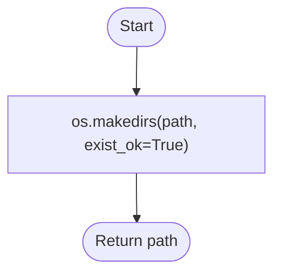

## `_load_detection_table`
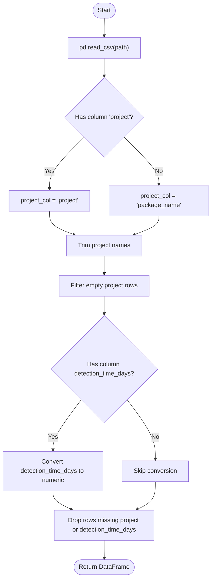

## `_load_build_counts`
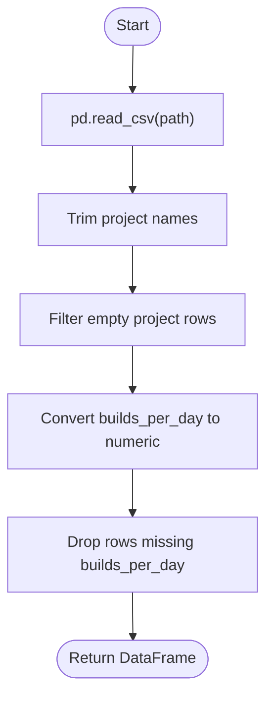

## `_normalize_to_date`
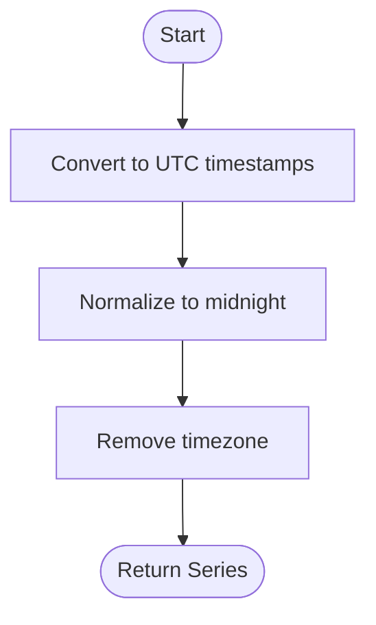

## `_prepare_schedule_for_waste_analysis`
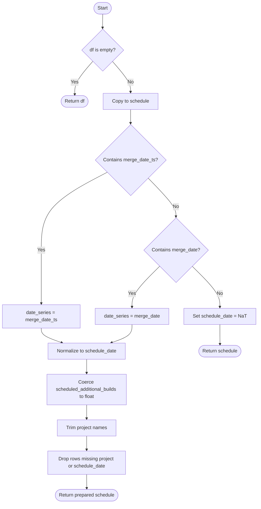

## `_safe_ratio`
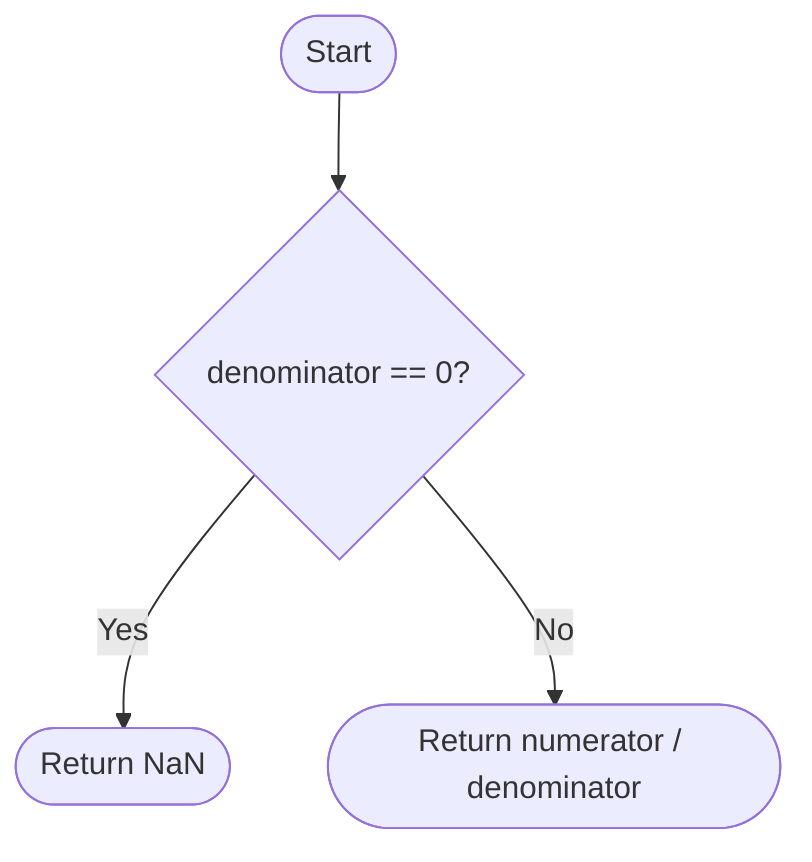

## `_baseline_detection_metrics`
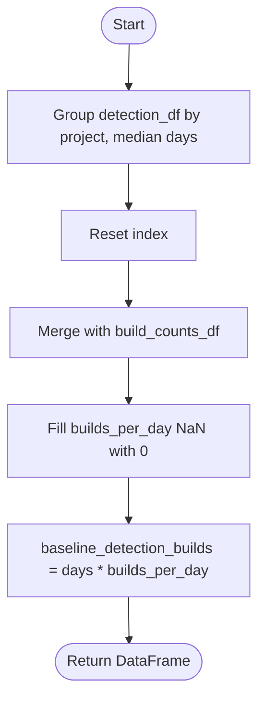

## `_build_threshold_map`
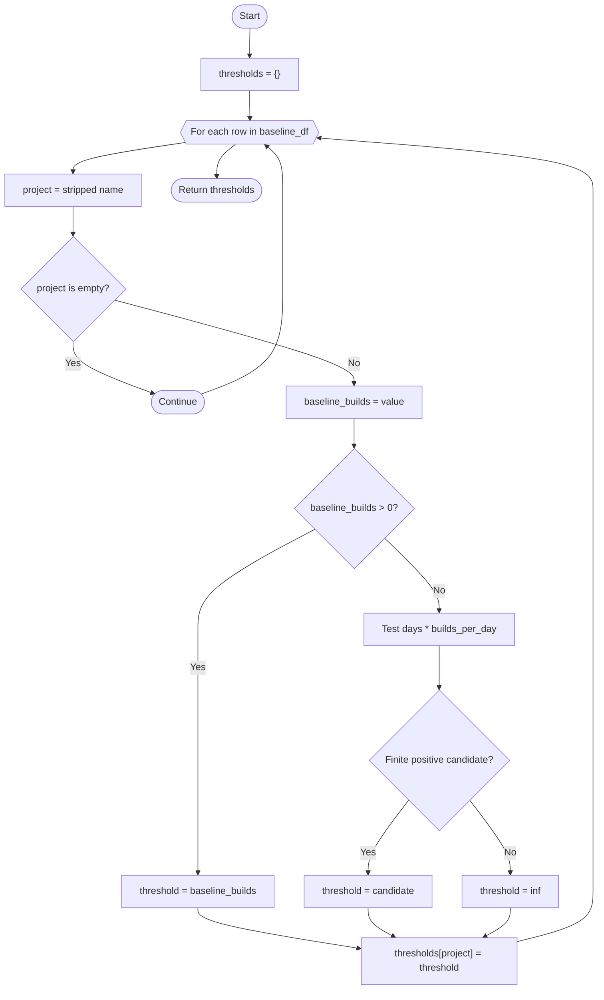

## `_prepare_project_metrics`
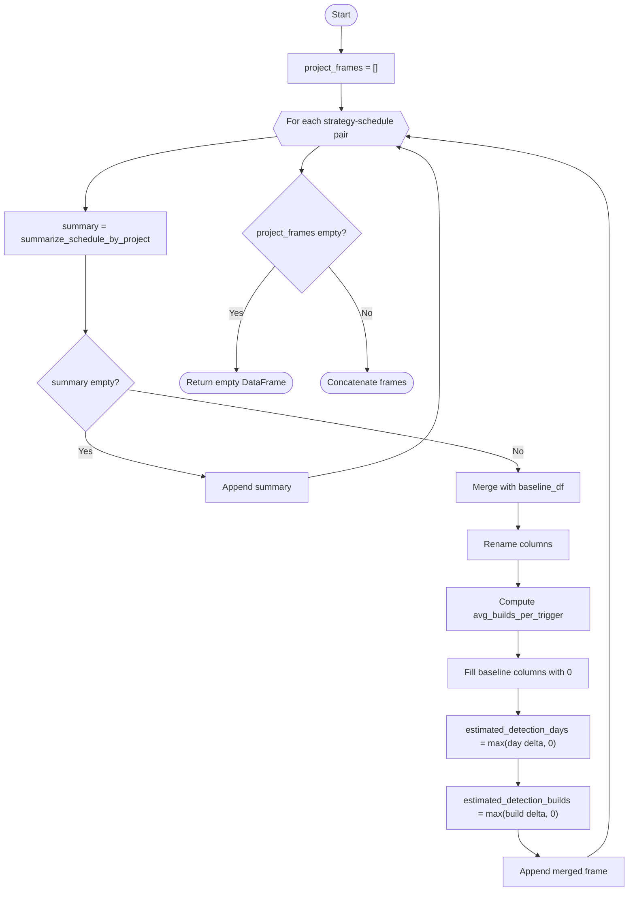

## `_aggregate_strategy_metrics`
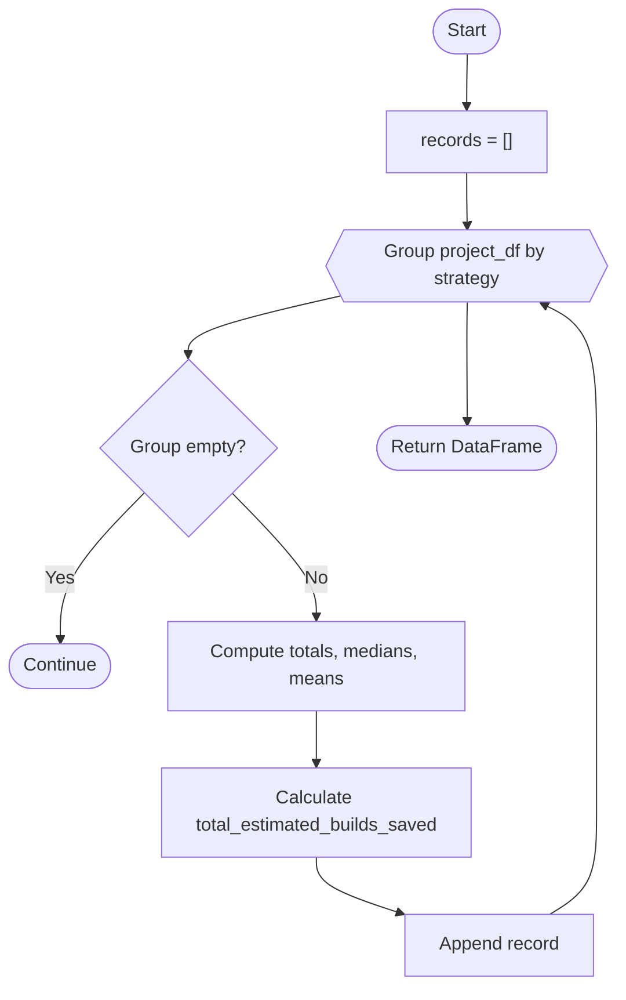

## `_prepare_daily_totals`
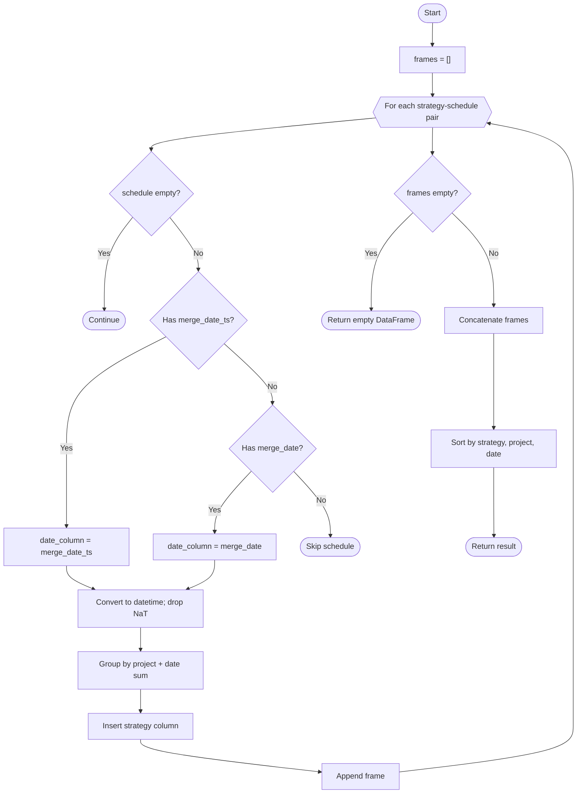

## `_summarize_wasted_builds`
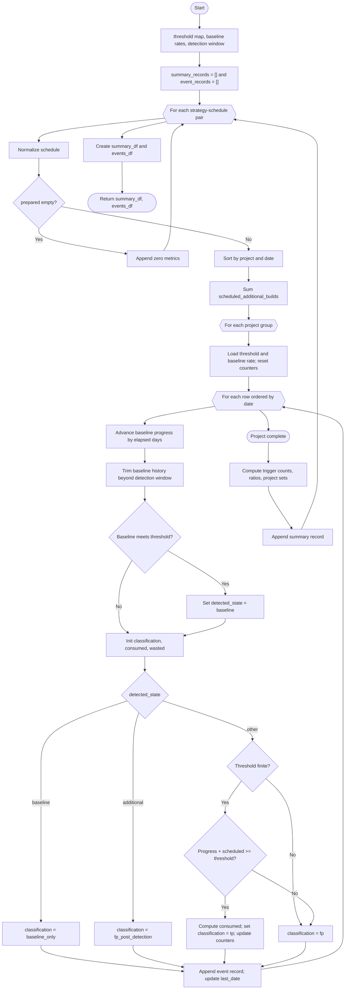

## `_plot_additional_builds_boxplot`
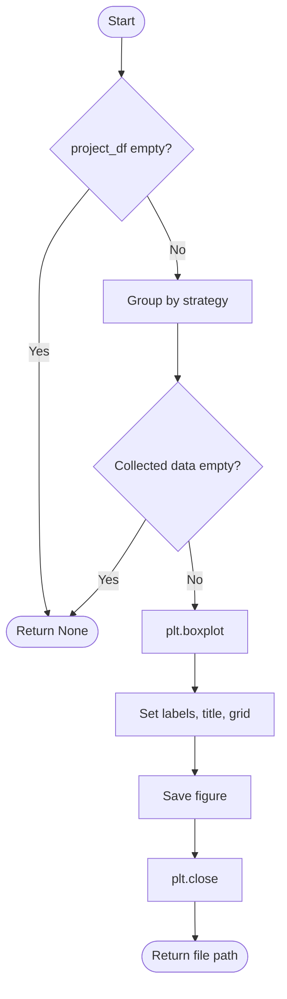

## `parse_args`
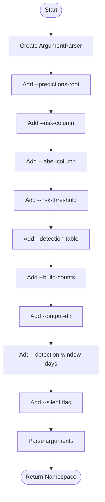

## `main`
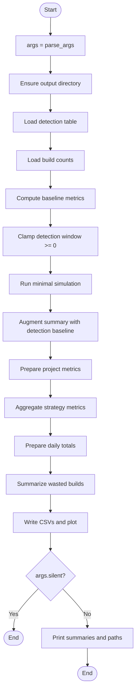
